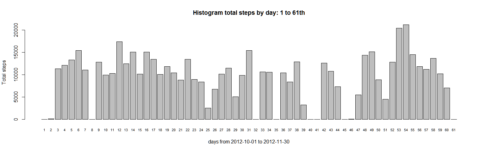
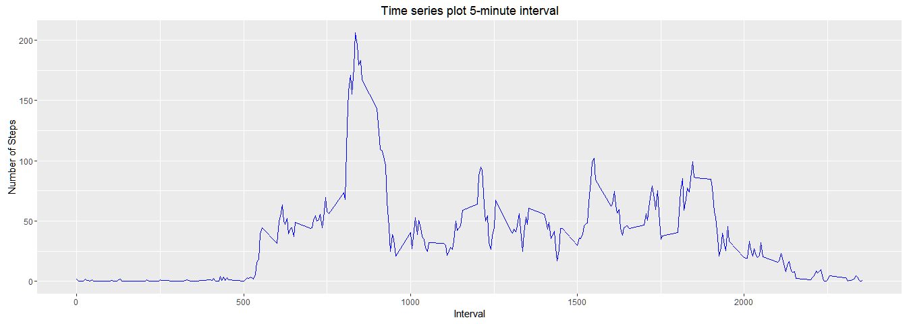
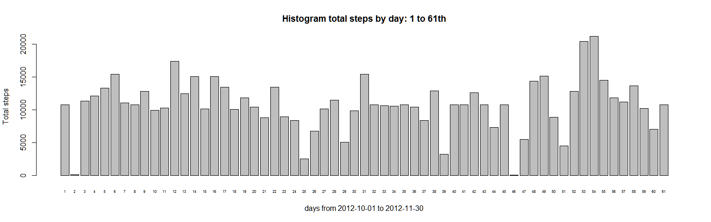
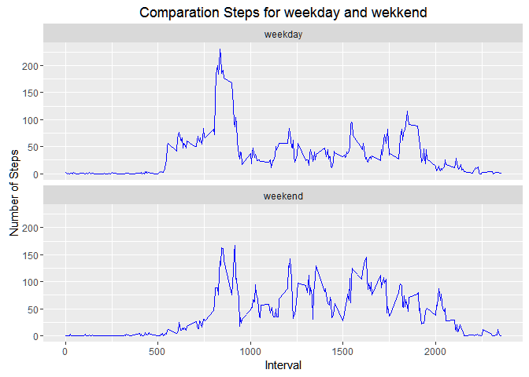

# Reproducible Research: Peer Assessment 1


## Loading and preprocessing the data

```r
unzip("activity.zip", list = FALSE, overwrite = TRUE)
read.csv("activity.csv",header=TRUE)->activity
summary(activity)
```

```
##      steps                date          interval     
##  Min.   :  0.00   2012-10-01:  288   Min.   :   0.0  
##  1st Qu.:  0.00   2012-10-02:  288   1st Qu.: 588.8  
##  Median :  0.00   2012-10-03:  288   Median :1177.5  
##  Mean   : 37.38   2012-10-04:  288   Mean   :1177.5  
##  3rd Qu.: 12.00   2012-10-05:  288   3rd Qu.:1766.2  
##  Max.   :806.00   2012-10-06:  288   Max.   :2355.0  
##  NA's   :2304     (Other)   :15840
```
## What is mean total number of steps taken per day?
### >Here is analyzed data and grouping for show mean per day


```r
totday<-aggregate(activity$steps,by=list(activity$date),FUN=sum,na.rm=TRUE)
colnames(totday)<-c("date","steps")
meant<-mean(totday$steps)
mediant<-median(totday$steps)

barplot(totday$steps,names.arg=as.numeric(totday$date),las=0,beside=TRUE,cex.names = 0.7,
        main="Histogram total steps by day: 1 to 61th",
        xlab="days from 2012-10-01 to 2012-11-30",ylab="Total steps")
```

<!-- -->
# Mean and Median per day

```r
#Mean
meant
```

```
## [1] 9354.23
```

```r
# Median
mediant
```

```
## [1] 10395
```

## What is the average daily activity pattern?

```r
#time series plot of the 5-minute interval (x-axis) and the average number of steps taken, averaged across all days (y-axis)
maxinterval<-aggregate(activity$steps,by=list(activity$interval),FUN=mean,na.rm=TRUE)
colnames(maxinterval) <- c("interval","meansteps")

q<-ggplot(maxinterval,aes(x=interval,y=meansteps))
q+geom_line(colour="blue")+labs(x= "Interval",y="Number of Steps",
                                title="Time series plot 5-minute interval")
```

<!-- -->

```r
# It is 5-minute interval, on average across all the days in the dataset, contains the maximum number of steps
maxinterval[maxinterval$meansteps==max(maxinterval[,2]),]
```

```
##     interval meansteps
## 104      835  206.1698
```


## Imputing missing values

```r
#Calculate and report the total number of missing values
table(is.na(activity$steps))
```

```
## 
## FALSE  TRUE 
## 15264  2304
```

```r
# all detail of NA  >>> activity[is.na(activity$steps),]
#Devise a strategy for filling in all of the missing values in the dataset - by interval
activityf<-merge(activity,maxinterval,by="interval")
activityf<-cbind(activityf,activityf$steps)
#Create a new dataset that is equal to the original dataset but with the missing data filled in
activityf[is.na(activityf$steps),]$steps <- activityf[is.na(activityf$steps),]$meansteps
#Make a histogram of the total number of steps taken each day and Calculate and report the mean and median 

totdayf<-aggregate(activityf$steps,by=list(activityf$date),FUN=sum,na.rm=TRUE)
colnames(totdayf)<-c("date","steps")
barplot(totdayf$steps,names.arg=as.numeric(totdayf$date),las=0,beside=TRUE,cex.names = 0.5,
        main="Histogram total steps by day: 1 to 61th",
        xlab="days from 2012-10-01 to 2012-11-30",ylab="Total steps")
```

<!-- -->

```r
meanf<-mean(totdayf$steps)
medianf<-median(totdayf$steps)
meanf
```

```
## [1] 10766.19
```

```r
medianf
```

```
## [1] 10766.19
```
###>After filling NAs in dataset histogram seems more uniform but similar to initial
###>New Mean and median are different from initial mean=9354.23  median=10395

## Are there differences in activity patterns between weekdays and weekends?

```r
# Build activityw with new field typday , it contains weekend= sabado, domingo (Latinamerica)
activityw <- activityf
activityw<-mutate(activityw,typday="weekday")
activityw[weekdays(as.Date(activityw$date),abbreviate = FALSE)=="sábado",]$typday <- "weekend"
activityw[weekdays(as.Date(activityw$date),abbreviate = FALSE)=="domingo",]$typday <- "weekend"

#time series plot of the 5-minute interval (x-axis) and the average number of steps taken, averaged across all days (y-axis)
meanswkdy<-aggregate(activityw$steps,by=list(activityw$typday,activityw$interval),
                     FUN=mean,na.rm=TRUE)
colnames(meanswkdy)<-c("typday","interval","meanwkdy")
```
###>Next plot shows several differences between two facets on graphic weekday/weekend

```r
q<-ggplot(meanswkdy,aes(x=interval,y=meanwkdy))
q+geom_line(colour="blue")+facet_wrap(~typday,nrow=2)+
            labs(x= "Interval",y="Number of Steps",
            title="Comparation Steps for weekday and wekkend")
```

<!-- -->


